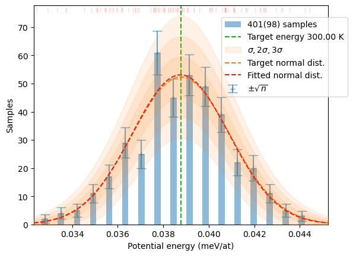

# HECSS


<!-- WARNING: THIS FILE WAS AUTOGENERATED! DO NOT EDIT! -->

HECSS is a Monte-Carlo, configuration space sampler using sample
weighting algorithm for probability distribution sampling. It provides
an alternative way to create representations of systems at thermal
equilibrium without running a very expensive molecular dynamics
simulation. The theoretical foundation of the code are presented in the
section [Background](background.html) in the
[Documentation](https://jochym.github.io/hecss/). More detailed examples
are included in the [LAMMPS](lammps_tutorial.html) and
[VASP](vasp_tutorial.html) tutorials.

You can try HECSS on binder:
[](https://mybinder.org/v2/gl/jochym%2Fhecss/devel?labpath=index.ipynb)

[](https://pypi.org/project/hecss/)
[](https://pypi.org/project/hecss/)
[](https://anaconda.org/conda-forge/hecss)
[](https://anaconda.org/conda-forge/hecss)
[](https://anaconda.org/jochym/hecss)
[](https://github.com/jochym/hecss/actions/workflows/test.yaml)
[](https://gitlab.com/jochym/hecss/-/commits/devel)

## A very short example

Minimal example using LAMMPS potential from the asap3 package and
OpenKIM database. Here we will sample the thermodynamic distribution of
3C-SiC crystal at 300K. We start by importing required modules, define
the crystal and energy/forces calculator, run the sampler and finally
plot the energy distribution.

``` python
from hecss import HECSS
from hecss.util import select_asap_model, create_asap_calculator
from hecss.monitor import plot_stats
from ase.build import bulk
```

Then we define the crystal and interaction model used in the
calculation. In this case we use 3x3x3 supercell of the SiC crystal in
zincblende structure and describe the interaction using LAMMPS potential
from the OpenKIM database and ASAP3 implementation of the calculator.

``` python
model = select_asap_model('SiC')
cryst = bulk('SiC', crystalstructure='zincblende', 
             a=4.38120844, cubic=True).repeat((3,3,3))
cryst.set_calculator(create_asap_calculator(model))
```

Then we define the sampler parameters (N – number of samples, T –
temperature) and run it. The parameter with the `lambda` anonymous
function is required in this case, due to the peculiarities of the ASAP
implementation of the ASE calculator which cannot be re-used when the
sampler is re-executed. This construct is probably not required for
other calculators.

``` python
T = 300
N = 100
hecss = HECSS(cryst, lambda : create_asap_calculator(model))
samples = hecss.sample(T, N)
distrib = hecss.generate(samples, T)
```

And finally we plot the histogram of the resulting energy distribution
which corresponds to the thermal equilibrium distribution.

``` python
plot_stats(distrib, T, sqrN=True)
```



## Install

The HECSS package is available on pypi and conda-forge additionally the
package is present also in my personal anaconda channel (jochym).
Installation is simple, but requires a number of other packages to be
installed as well. Package managers handle these dependencies
automatically.

### Install with pip

It is advisable to install in a dedicated virtual environment e.g.:

``` bash
python3 -m venv venv
. venv/bin/activate
```

then install with `pip`:

``` bash
pip install hecss
```

### Install with conda

Also installation with conda should be performed for dedicated or some
other non-base environment. To create dedicated environment you can
invoke `conda create`:

``` bash
conda create -n hecss -c conda-forge hecss
```

or you can install in some working environment `venv`:

``` bash
conda install -n venv -c conda-forge hecss
```

### Example data archive

The example subdirectory from the source may be downloaded directly from
the source repository:
[hecss-examples.zip](https://gitlab.com/jochym/hecss/-/archive/master/hecss-master.zip?path=example)

### The source code

The source is published at the [Gitlab hecss
repository](https://gitlab.com/jochym/hecss). You can access it with git
(recommended, particularly if you want to contribute to the
development):

``` bash
git clone https://gitlab.com/jochym/hecss.git
```

or you can download the whole distribution as a zip archive:
[hecss.zip](https://gitlab.com/jochym/hecss/-/archive/master/hecss-master.zip)
