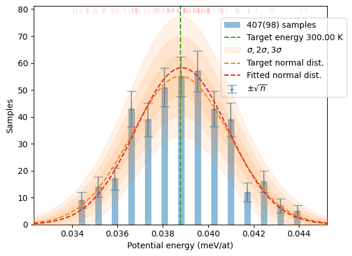

# HECSS


<!-- WARNING: THIS FILE WAS AUTOGENERATED! DO NOT EDIT! -->

HECSS is a Monte-Carlo, configuration space sampler using sample
weighting algorithm for probability distribution sampling. It provides
an alternative way to create representations of systems at thermal
equilibrium without running a very expensive molecular dynamics
simulation. The theoretical foundation of the code are presented in the
section [Background](background.html) in the
[Documentation](https://jochym.github.io/hecss/). More detailed examples
are included in the [LAMMPS](lammps_tutorial.html) and
[VASP](vasp_tutorial.html) tutorials.

You can try HECSS on binder:
[](https://mybinder.org/v2/gl/jochym%2Fhecss/devel?labpath=nbs/index.ipynb)

[](https://pypi.org/project/hecss/)
[](https://pypi.org/project/hecss/)
[](https://anaconda.org/conda-forge/hecss)
[](https://anaconda.org/conda-forge/hecss)
[](https://anaconda.org/jochym/hecss)
[](https://github.com/jochym/hecss/actions/workflows/test.yaml)
[](https://gitlab.com/jochym/hecss/-/commits/devel)

## A very short example

Minimal example using LAMMPS potential from the asap3 package and
OpenKIM database. Here we will sample the thermodynamic distribution of
3C-SiC crystal at 300K. We start by importing required modules, define
the crystal and energy/forces calculator, run the sampler and finally
plot the energy distribution.

``` python
from hecss import HECSS
from hecss.util import select_asap_model, create_asap_calculator
from hecss.monitor import plot_stats
from ase.build import bulk
```

Then we define the crystal and interaction model used in the
calculation. In this case we use 3x3x3 supercell of the SiC crystal in
zincblende structure and describe the interaction using LAMMPS potential
from the OpenKIM database and ASAP3 implementation of the calculator.

``` python
model = select_asap_model('SiC')
cryst = bulk('SiC', crystalstructure='zincblende', 
             a=4.38120844, cubic=True).repeat((3,3,3))
cryst.calc = create_asap_calculator(model)
```

Then we define the sampler parameters (N – number of samples, T –
temperature) and run it. The parameter with the `lambda` anonymous
function is required in this case, due to the peculiarities of the ASAP
implementation of the ASE calculator which cannot be re-used when the
sampler is re-executed. This construct is probably not required for
other calculators.

``` python
T = 300
N = 100
hecss = HECSS(cryst, lambda : create_asap_calculator(model))
samples = hecss.sample(T, N)
distrib = hecss.generate(samples, T)
```

And finally we plot the histogram of the resulting energy distribution
which corresponds to the thermal equilibrium distribution.

``` python
plot_stats(distrib, T, sqrN=True)
```



## Installation

The HECSS package is available on PyPI and conda-forge. Installation is
straightforward and handles all dependencies automatically through
package managers.

### Install with pip

It is advisable to install in a dedicated virtual environment:

``` bash
python3 -m venv venv
source venv/bin/activate  # On Windows: venv\Scripts\activate
pip install hecss
```

### Install with conda

Installation with conda should be performed in a dedicated or existing
non-base environment:

``` bash
# Create a new environment with hecss
conda create -n hecss -c conda-forge hecss
conda activate hecss

# Or install in an existing environment
conda install -c conda-forge hecss
```

### Example data

Example data and notebooks can be downloaded directly from the [source
repository](https://github.com/jochym/hecss/tree/master/examples) or
accessed through the Binder link above.

## Development

1.  **Clone the repository:**

    ``` bash
    git clone https://gitlab.com/jochym/hecss.git
    cd hecss
    ```

2.  **Create the environment:** The repository includes an
    `environment.yml` file for creating a Conda environment with all
    dependencies and the package installed in editable mode.

    ``` bash
    conda env create -f environment.yml
    conda activate hecss-dev
    ```

3.  **Workflow:** This project uses `nbdev`. All code changes should be
    made in the notebooks located in the `nbs/` directory.

    - After modifying notebooks, run:

      ``` bash
      nbdev_export
      ```

    - To update the README, modify `nbs/index.ipynb` and run:

      ``` bash
      nbdev_readme
      ```

    - To generate full documentation locally, run:

      ``` bash
      nbdev_docs
      ```
